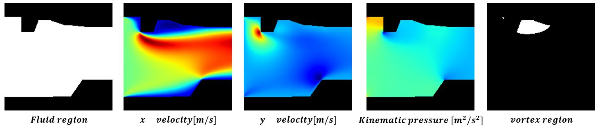
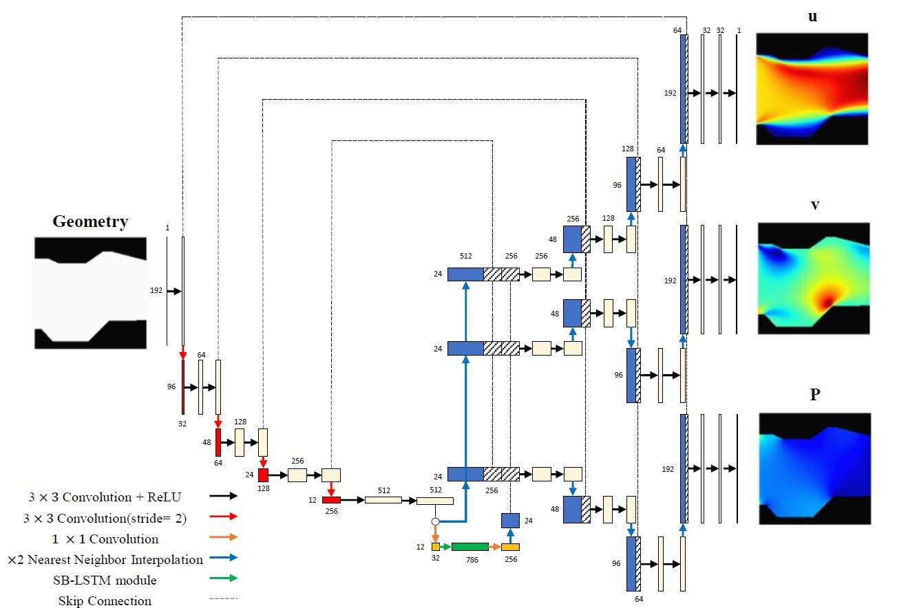

# Internal Flow Prediction in Arbitrary Shaped Channel Using Stream-wise Bidirectional LSTM
### [Paper] | [BibTex]

## Abstract

Deep learning (DL) methods have become the trend in predicting feasible solutions in a shorter time compared with traditional computational fluid dynamics (CFD) approaches. Recent researches have stacked numerous convolutional layers to extract high-level feature maps which are then used for the analysis of various shapes under differing conditions. However, these applications only deal with predicting the flow around the objects located near the center of the domain, whereas most fluid transport-related phenomena are associated with internal flow, such as pipe flow or air flows inside transportation vehicle engines. Hence, to broaden the scope of the DL approach in CFD, we introduced a stream-wise bidirectional (SB)-LSTM module that generates a better latent space from the internal fluid region by additionally extracting lateral connection features. To evaluate the effectiveness of the proposed method, we compared the results of using the SB-LSTM to the encoder-decoder(ED) model and the U-Net model with the results when not using it. When SB-LSTM was applied, in the qualitative comparison, it effectively addressed the issue of erratic fluctuations in the predicted field values. Furthermore, in terms of quantitative evaluation, the mean relative error (MRE) for the x-component of velocity, y-component of velocity, and pressure were reduced by at least 2.7%, 4.7%, and 15% respectively, compared to the absence of the SB-LSTM module. Furthermore, through a comparison of calculation time, it shows that our approach does not undermine the superiority of neural network's computational acceleration effect.

## Prerequisites
- Python 3.11.3
- PyTorch>=2.0.0
- Torchvision>=0.15.1Z:\paper\Final_UNET_LSTM\models\architecture.py
- NVIDIA GPU + CUDA cuDNN

- - ### Install PyTorch and dependencies from http://pytorch.org
- ### Please install dependencies by

## Dataset

A dataset for this project can be downloaded using the following URL:

https://drive.google.com/file/d/1FY-TQfmuadkNOFuSsg1CbuB-kJ2I8612/view?usp=share_link

In this dataset, there are a total of 10,000 npy data stored. Each npy file has a size of 5X192X192, in the order of fluid region, x-velocity, y-velocity, pressure, and corner vortex region.



To use the uploaded dataset in the codes, it should be allocated to the train, test, and valid folders in dataset directory with the desired ratio.

## Preprocessing

After preparing the dataset, the mean value of the data_process/CFDdataset.py file needs to be modified according to the dataset for channel normalization performed as a preprocessing for effective learning. Note that in the code, the default normalization values for x, y velocity, and pressure are all set to 1.
```python
    def transforms(self, data) :
        # Slice Input Data
        input = data[0, :, :]
        # Slice Target Data
        target = data[1:4, :, :]
        # Convert Input and Target Data to PyTorch Tensor
        input = torch.FloatTensor(input).unsqueeze(0)
        target = torch.FloatTensor(target)
        # Convert Target Statistic Data to PyTorch Tensor
        mean = torch.FloatTensor([1, 1, 1]).unsqueeze(-1).unsqueeze(-1)
        return input, target, mean
        
```
## Codes

The structure of the attached code is based on U-Net with SBLSTM, which showed the best performance in the paper. The UNet-with-SBLSTM is designed as shown in the diagram below.


Code modification is necessary to omit the SB-LSTM module or skip connections.

## Train


## Test
